<!-- 

-->

 
    

 

##  👋Who am i

- 在校学生 A student
- 喜欢写垃圾代码（） Likes to creat useless things.
- [个人博客（实际上很少更新的） Personal Blog](https://blog.enlysure.com)

## 📫Contact me

-   [GitHub](https://github.com/Rovniced)
-   [E-mail](mailto:enlysure@gmail.com)
-   [Telegram](https://t.me/luotianyi_bot)

 
  

 
